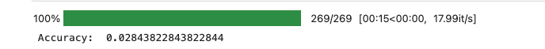
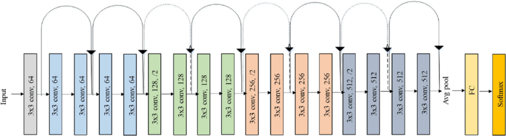
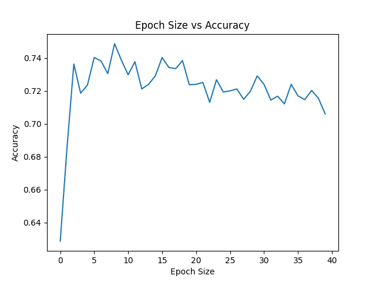

# Group Report

## 1. Introduction

Summary of the task and main goals/contributions/insights of the project.

## 2. Description of the task/dataset

Description of the task and dataset, including relevant statistics of dataset splits. 

## 3. Methodology

**CNN Model**
As the problem is a complex computer vision problem a Convolutional Neural Network is the obvious choice as other approaches such as a bayesian classifier would be far too simple. Therefore we set about creating a CNN for multi class classification. The model had 2 convolution layers fed into a pooling layer which was flattened and then input to a 3 dense layers all with Relu activation apart from the output layer which was linear.

    
    
<strong>Fig x</strong>

As can be seen in fig X the models accuracy was very poor performing below what is expected in almost every regard achieving an accuracy of ~3%. This is a good sign that the model isn’t complex enough to generate meaningful insight for accurate prediction. Therefore we decided to implement a different model.

**Deep Learning Model**
As the task of classifying 120 different dog breeds is a complex task and it was quickly discovered that a simple CNN model was not sufficiently complex to provide accurate classification. Hence the decision to use a pre-trained model. Pre-trained models provide significant advantages for complex tasks such as image classification as they have already been trained on a large dataset and have a proven architecture. For the application of image classification, models are trained on a large dataset of images the ResNet 18 model we chose is trained on the ImageNet Dataset which contains 14,197,122 annotated images
https://paperswithcode.com/dataset/imagenet#:~:text=The%20ImageNet%20dataset%20contains%2014%2C197%2C122%20annotated%20images%20according%20to%20the%20WordNet%20hierarchy
This provides a generalised image classification model that can then be fine tuned to the specific task as required by adding additional layers or modifying the output layer to predict the classes. Pre-trained models help to increase accuracy for complex tasks as a model trained on a large and diverse dataset can generalise to similar problems faster and with much smaller datasets such as the stanford dogs dataset.

    
    
Fig x ResNet18 Architecture (https://www.researchgate.net/publication/336642248_A_Deep_Learning_Approach_for_Automated_Diagnosis_and_Multi-Class_Classification_of_Alzheimer's_Disease_Stages_Using_Resting-State_fMRI_and_Residual_Neural_Networks)

The pre trained model selected was ResNet 18. There are many other good choices such as  Inception, VGG and MobileNet. The reason ResNet was selected was due to its efficiency and resistance to overfitting. This is mainly due the residual connections (denoted by the arrows in fig x) which can skip layers ensuring that the model keeps learning 

**<u>Data Preprocessing</u>**

**Normalisation** which is necessary for  ResNet 18 was chosen as the images needed to be transformed into the same standardised input that the model was originally trained on. So images were transformed to the following specification:

●Image size 224x224
●All image pixel values are converted to RGB and then normalised to using the same mean and standard deviation for each red green and blue value from the ImageNet dataset that the ResNet18 model was originally trained on.

**<u>Parameter Optimisation</u>**
In order to optimise the hyper parameters of the model a development set consisting of 50% of the test set was used. A Validation set is needed in order to train hyper parameters as using the test set can mean that the model becomes overfit to the test set.

**Optimiser**: The adam optimiser was used for its straightforward implementation and fast convergence. Due to its variable learning rate and momentum.
●**Learning rate**: arguably one of the most important hyperparameters 

    
ADD LEARNING RATE GRAPH

EXPLAIN BEST LR
 
**Batch and Epoch Size**: To find the optimal batch and epoch size 

    
BATCH GRAPH

BATCH EXPLANATION

    
    
Fig x ResNet18 Architecture

EPOCH EXPLANATION

## 4. Experimental setting

Description of the specific details of the evaluation (e.g. parameter tuning, usage of the development set).

## 5. Results

Final results of the experiments, including baselines and table/s with precision/recall/accuracy/f1, etc.

## 6. Analysis

Analysis of the results, error analysis (investigate the type of error the system makes, etc.).

## 7. Literature review / Related work

Overview of the related work most connected to the methods and tasks of the projects. Explain the differences and the connection between works in the literature with respect to the employed method (e.g. advantages/disadvantages, ideas you exploited, etc.).
Tip: Google Scholar is an excellent resource to find relevant articles to any of the topics.

## 8. Conclusion and future work

Summary of the main conclusions and takeaways from the experiments. Explain ways to investigate or improve the method in the future.

## 9. Git repository

Github repository: https://github.com/ziruiz2024/CMT316CW2.git
