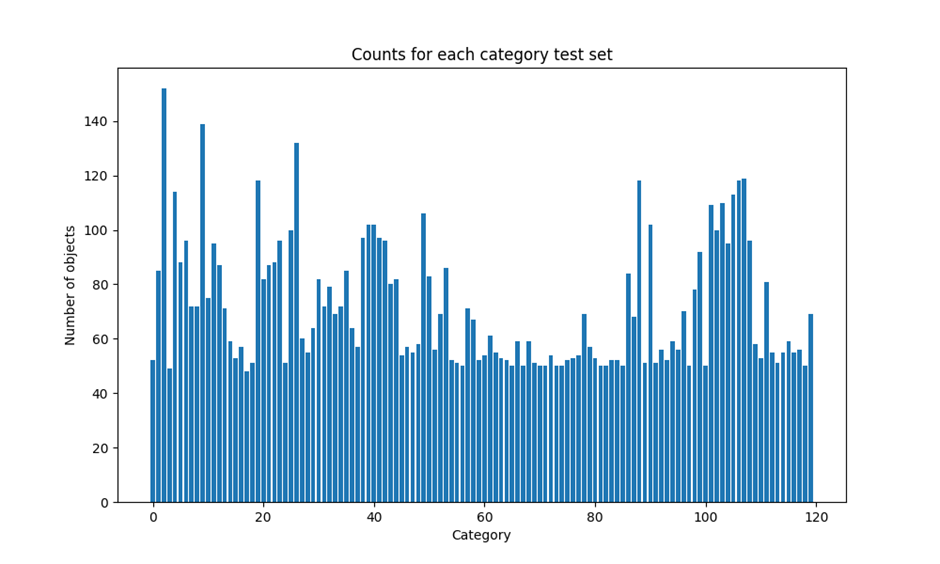

# Group Report

## 1. Introduction

The project that was chosen to be implemented and documented by the group was “Fine-grained image classification (Dogs)”. In this project it is the aim to develop an algorithm to classify dogs that are within an image into specific sub-categories such as breeds. This is hoped to be achieved through numerous steps such as pre-processing, model selection, model training, parameter optimization and evaluating the model. Through these steps we believe that a model can be created that classifies dog breeds to a high accuracy (>70%) and is able to generalise well to new unforeseen images.

Each member of the team has been allocated specific roles to ensure an efficient implementation of the project to maximise productivity. These roles include, “dataset & error analysis”, “pre-processing & literature” and “implementation & results”. These outlined roles allow members to focus on aspects of the project that they have more experience with and will allow for better communication between members for any issues that may arise.

Through the classification project we hope to gain valuable insights in the implementation of machine learning algorithms that are specifically used in image classification. These insights may include limitations that occur at different stages of implementation and how they were overcome, and what methods at these different stages provided the best results through performance evaluation.

## 2. Description of the task/dataset

### Introduction

In this task we will focus on images containing dogs as the object and with the assistance of machine learning classify these into specific breeds/categories. The dataset used for this task is the Stanford Dogs Dataset (found at this link: http://vision.stanford.edu/aditya86/ImageNetDogs/). The dataset has been built using images and annotations from ImageNet for the task of fine-grained image categorization containing 120 breeds of dogs from around the world with a total of 20,580 images.

### Images

    
    
Figure 1 Example image

Figure 1 Example image
The Images file contains the jpg images of the dog object in various settings. An example of an image is given above in Figure 1.

### Annotations

    
    
Figure 2 Example XML Info

The annotation file is an xml document with each image having its own annotation. An example of annotation is seen above in Figure 2 containing the following elements:

- <filename>: Refers to which image it is representing. In the case of Figure 1 this would be “n02085620_7”.
- <folder>: Folder name where image is located.
- <source>: Contains information about the image database specifying that it comes from the ImageNet database.
- <size>: Size of the image with <width>, <height>, and <depth> being specified in this case 300, 430, and 3.
- <segment>: Specifies if segmented or not.
- <object>: Contains information about the object that is in the image.
- <name>: Name/Breed of dog.
- <pose>: Pose of object.
- <truncated>: Truncated or not.
- <difficult>: If the image is difficult to see or not.
- <bndbox>: Information on the bounding box around the dog in the image. Within this the <xmin>, <ymin>, <xmax>, and <ymax> pixel values are defined that sets the boundary around the object.

### Train and Test list

    
    
    
Figure 3 Category counts of test and train set

The training and testing data are contained in two .mat files named train_list.mat and test_list.mat. These files contain the file names of all images in the file_name array, corresponding annotation file path of each image in an annotation_list array, and an array of corresponding labels for each image indicating which category it belongs to. The number of samples in the training set is 12000 and the test set contains 8580 samples.

The above graphs Figure 3 shows the number of objects on the y-axis and the categories of objects on the x-axis. Figure 3 shows that it is equal for every class with each category containing 100 objects meaning that the objects are distributed evenly. This is ideal for training as it ensures that the model will not be biassed towards any specific category. The test object distribution shown in Figure 3 reveals a high variance of total objects per category. Indicated by a significant difference between the highest and lowest number of objects across categories being 104 and standard deviation of 23.22. Benefits of high variance are that it mimics real-world classifying scenarios in that there is a high likelihood that one category may be more prominent than other categories. From this we gain a better understanding of how the model may work in a practical setting. Downsides to high variance may include metrics becoming less sensitive to misclassifications in less common categories. Meaning that even with a significant number of misclassifications in an uncommon category were to happen it may not significantly impact the overall accuracy of the classifier, possibly leading to misleading results.

    
    
Figure 4 Image width vs height (Train)

    
    
Figure 5 Image width vs height (Train)

The two scatter graphs Figure 4, and Figure 5 show the width/height coordinates for all the images in training and test sets. Both graphs follow a similar trend for height and width, with a fair number of points lying outside the cluster in the higher range of pixels. The results of this graph indicate that images should be resized to a standard size to ensure consistent processing.

## 3. Methodology

### Model Selection

**CNN Model**
As the problem is a complex computer vision problem a Convolutional Neural Network is the obvious choice as other approaches such as a bayesian classifier would be far too simple. Therefore we set about creating a CNN for multi class classification. A 2 layer CNN with one dense layer was created.

As can be seen in table 1 the models accuracy was very poor performing below what is expected in almost every regard achieving an accuracy of ~34-24%. This is a good sign that the model isn’t complex enough to generate meaningful insight for accurate prediction. Therefore we decided to implement a different model.

**Deep Learning Model**
The task of classifying 120 different dog breeds is a complex task and it was quickly discovered that a simple CNN model was not sufficiently complex to provide accurate classification. Hence the decision to use a pre-trained model. Pre-trained models provide significant advantages for complex tasks such as image classification as they have already been trained on a large dataset and have a proven architecture. For the application of image classification, models are trained on a large dataset of images. ResNet 18, our initial top candidate for the task, is trained on the ImageNet Dataset which contains 14,197,122 annotated images according to (Russakovsky et al. 2014).This provides a generalised image classification model that can then be fine tuned to the specific task as required by adding additional layers or modifying the output layer to predict the classes. Pre-trained models help to increase accuracy for complex tasks as a model trained on a large and diverse dataset can generalise to similar problems faster and with much smaller datasets such as the stanford dogs dataset.

    
    
Figure 6 ResNet18 Architecture (Farheen Ramzan, et al)

After comparing the performance of different deep learning models we decided to switch to the efficientnet_b4 deep learning model. There are many other good choices such as  Inception, VGG and MobileNet. Efficientnet_b4 was chosen due to its performance in testing as can be seen in (Table 2). Effcientnet_b4 introduced by (Tan et al 2020). Is a deep learning architecture developed for computer vision tasks. When compared in tests against other deep learning models on the same imageNet dataset that ResNet was trained on, by the Google Brain team it provided superior accuracy with less parameters than others (see fig bellow).

    
    
Figure 7 Deep Learning Model Comparison on ImageNet dataset (Tan et al 2020)

Not only does the efficientNet-B4 model provide superior accuracy, it has a is also more efficient due to its simple structure “Compared with the widely used ResNet-50, our EfficientNet-B4 uses similar FLOPS, while improving the top-1 accuracy from 76.3% of ResNet-50 to 82.6% (+6.3%)” (Tan et al 2020). The efficentNet Architecture utilises compound scaling which scales the model from a baseline architecture. To generate a wider/ deeper model consisting of 5 components. The models are scaled according to a coefficients ɑ , 𝛃 and γ raised to an exponent of ɸ. Each coefficient represents depth, width and resolution respectively. Optimal values of these parameters were found by researchers in order to create a family of balanced efficientNet architectures 0-7, With 0 being the smallest and 7 being the largest. The best size of model can then be selected based on the accuracy required and the resources available. We decided to choose the efficientNet-B4 structure as it provided the best accuracy and was still trainable within a reasonable time frame. A larger EfficentNet structure may have provided better results however we didn’t have the sufficient resources to train such a model.

### Data Preprocessing

Normalisation, which is necessary for the EfficentNet_B4 model, was chosen to transform the images into the same standardised input that the model was originally trained on. So images were transformed to the following specification:
- Image size 224x224 which strikes a balance between model accuracy and complexity.
- All image pixel values are converted to RGB and then normalised to using the same mean and standard deviation for each red green and blue value from the ImageNet dataset that the EfficentNet_B4 model was originally trained on.

Freezing Layers: In order to keep the original generalisation and feature extraction of the original pre-trained, some of the layers in the network are “Frozen” meaning that their parameters are not updated during training. It also has the additional benefit of speeding up the training process as less layers need to be updated.

## 4. Experimental setting

A simple version of CNN model with two convolutional layers will be experimented to compare with a variety of deep learning architectures. Tested architectures include ResNet18, ResNet34, ResNet50, ResNet101, ResNet152, EfficientNetb0, EfficientNetb1, EfficientNetb2, EfficientNetb3, EfficientNetb4, ViT-b-16, and ViT-b-32. ResNet and EfficientNet are fully convolutional models - they stack convolutional layers to form a deep network. ViT is a transformer-based model which is a popular architecture in recent years designed for natural language processing tasks. These models are all pre-trained on ImageNet dataset and fine-tuned on the dataset used in this project.

The training batch size for stochastic gradient descent algorithm will be tested for 32, 64, and 128. Some of the models fail to run on my GeForce RTX 3080 GPU with batch size 64 or 128 due to the limitation of GPU memory. The other experiment settings are fixed as follows: the data will be randomly flipped horizontally and then normalized with mean and standard deviation of ImageNet dataset. The input resolution to each model is set fixed as 224x224 by random cropping and resizing. We used the Adam optimizer, with learning rate set to 0.0001 initially. The scheduler will reduce the learning rate by a factor of 0.1 if the validation accuracy does not improve for 3 consecutive epochs. The training will stop if the learning rate drops below 1e-6. This setting is applied to all models for fair comparison. The loss function is set to cross-entropy loss.

The results of the accuracies are listed as follows:

| | model | batch_size | train_acc_best | test_acc_best |
| --- | --- | --- | --- | --- |
|0|	resnet18|	32|	0.8952|	0.7901|
|1|	resnet18|	64|	0.8923|	0.7921|
|2|	resnet18|	128|	0.8804|	0.7939|
|3|	resnet34|	32|	0.9104|	0.8091|
|4|	resnet34|	64|	0.9048|	0.8253|
|5|	resnet34|	128|	0.9158|	0.8282|
|6|	resnet50|	32|	0.9069|	0.8393|
|7|	resnet50|	64|	0.9097|	0.8488|
|8|	resnet101|	32|	0.9293|	0.829|
|9|	resnet152|	32|	0.9415|	0.8228|
|10|	efficientnet_b0|	32|	0.8962|	0.8439|
|11|	efficientnet_b0|	64|	0.901|	0.8452|
|12|	efficientnet_b1|	32|	0.9046|	0.8643|
|13|	efficientnet_b2|	32|	0.912|	0.8731|
|14|	efficientnet_b3|	32|	0.9059|	0.8758|
|15|	efficientnet_b4|	32|	0.901|	0.8974|
|16|	efficientnet_b1|	64|	0.919|	0.877|
|17|	vit_b_16|	32|	0.9463|	0.8853|
|18|	vit_b_32|	32|	0.9357|	0.7441|
|19|	vit_b_32|	64|	0.9347|	0.5486|
|20|	vit_b_32|	128|	0.9295|	0.8333|
|21|	twolayerscnn|	32|	0.3427|	0.1871|
|22|	twolayerscnn|	64|	0.2402|	0.1596|

The loss histories of the models are shown in the following figures:

    
    
Figure 8 Models accuracy and loss over epochs on test and train datasets

From the plots, we see that the general trends for each deep learning models are similar, where the loss quickly dropped to very low and then fluctuated around certain values. The sudden increases in the test accuracies are caused by the learning rate reduction. There are no sign of overfitting.

To make a comparison, we first observe that the two-layers CNN model struggled to converge, as the loss only decreased slightly and the test accuracy was very low. The result reveals that EfficientNetb4 obtained the highest accuracy, where ViT series are the second, and ResNet series are the worst. The accuracies increased with the increase in batch size, that means smaller batch size can lead to more stable convergence. This can also be reflected in the loss history plot, it is apparent that the loss of models with smaller batch size fluctuated in less magnitude. Furthermore, within a same architecture, the models with larger capacity (e.g. ResNet152 vs ResNet18) tend to have better performance, this reveals that the complexity of the model is crucial to classifying this specific dataset. If better hardwares are available, we believe that the performance of the models can be further improved by increasing the batch size and the size of the model, considering they are not yet overfitting and still have room for improvement.

## 5. Results

Our evaluation focused on various convolutional and transformer-based models, each tested for its effectiveness in classifying 120 distinct dog breeds using the Stanford Dogs dataset. The models demonstrated varied performance, with detailed metrics summarised below:
- EfficientNet B4 architecture achieved the highest accuracy of 89.52% with a batch size of 32, underscoring its balance of efficiency and performance.
- ViT_b architecture showed potential in capturing broader image features, although they had mixed results in precision and recall.
- ResNet architecture varied significantly, with deeper models generally performing better, highlighting the importance of model depth in complex classification tasks.

### Detailed Performance Metrics

We observed that the two-layer CNN model performed significantly below expectations, achieving an accuracy of only approximately 18.71%, which underlines its inadequacy for such a complex task. On the other hand, the EfficientNet and ViT models showed remarkable performance, with the EfficientNet B4 model with a 32 batch size achieving the highest accuracy of 89.52%. In conducting our investigation, the metrics we decided to focus on the following metrics:

Accuracy:  Measuring the proportion of total predictions that are correct. In dog breed classification, accuracy is a primary indicator of how well the model performs across all breeds. High accuracy means the model correctly identifies the breed most of the time, which is crucial for applications where correct breed identification impacts decisions, such as in veterinary medicine or canine breeding.

Precision: Assesses the proportion of predicted positives that are truly positive. Precision is particularly important when the consequences of falsely identifying a breed are significant. High precision ensures that when a model predicts a breed, it is correct, minimising the risk of false positives.

Recall: Measures the ability of the model to find all the relevant cases (all actual positives). A model with high recall ensures it identifies most dogs of a particular breed correctly, thus not missing out on breeds that are less represented or harder to classify.

F1-Score: The F1-score is the harmonic mean of precision and recall. Because it balances precision and recall, the F1-score is particularly useful in situations where an equal trade-off between false positives and false negatives is crucial. In dog breed identification, a high F1-score indicates a robust model that maintains both precision and recall.

Below is a summarization of the key training metrics from our best-performing models:

    
    
Figure 8 Models accuracy and loss over epochs on test and train datasets

These results underscore the critical role of model architecture in achieving high accuracy, with deeper and more complex networks generally outperforming simpler ones. For a visual representation of model performance over training epochs, refer to Figures 9 through 19, which illustrate accuracy, precision, recall, and F1-score trends.

    
    
Figure 9 Resnet Accuracy

    
    
Figure 10 Efficientnet Accuracy

    
    
Figure 13 Resnet Precision

    
    
Figure 14 Efficientnet Precision

    
    
Figure 15 Resnet F1-Score

    
    
Figure 16 Efficientnet F1-Score

    
    
Figure 17 Resnet Recall

    
    
Figure 19 Efficientnet Recall

Our models demonstrated varying degrees of efficiency in classifying dog breeds, with certain patterns of misclassification. We observed that misclassifications tended to occur more frequently among breeds that share physical similarities or were underrepresented in the training dataset. This suggests potential areas for improving data representation or model sensitivity to distinct features. Additionally, issues like image quality and lack of variability in image poses and environments also contributed to these classification errors. Such factors underscore the importance of robust dataset curation and model training strategies that can handle diverse and challenging real-world conditions. Our models, including those pre-trained on general datasets like ImageNet, displayed difficulty in distinguishing between breeds with similar morphological characteristics. The error rates were particularly high for breeds that are underrepresented in the dataset and those depicted in less diverse poses and environments. Image quality issues, such as low resolution and poor lighting, compounded the difficulty in accurately classifying these breeds.

Among the various models evaluated, EfficientNet-B4 emerged as the standout choice for our project on fine-grained image classification of dog breeds. This decision was driven primarily by its superior performance metrics observed during our experiments. The model not only achieved the highest accuracy but also demonstrated excellent precision, recall, and F1 scores, indicating a balanced capability in both detecting the correct breeds and minimising errors.

## 6. Error Analysis

Error Analysis is one of the most crucial parts in the development workflow of any machine learning model. To analyse the performance of our trained model, we used the test set provided as part of the Stanford Dogs dataset, comprising approximately 8K images, divided between a total of 120 breeds.

The error analysis carried out was part of a completely automated approach so it could be iterated on different sets of data.

To do this, we opted for the standard approach of constructing a confusion matrix-like structure over the data to see where the misclassifications are happening. The following table represents information regarding the analysis.

    
    
TableX

## 7. Literature review / Related work

Overview of the related work most connected to the methods and tasks of the projects. Explain the differences and the connection between works in the literature with respect to the employed method (e.g. advantages/disadvantages, ideas you exploited, etc.).
Tip: Google Scholar is an excellent resource to find relevant articles to any of the topics.

## 8. Conclusion and future work

In conclusion, our project focused on developing a machine learning model that was able to determine objects within an image into specific sub-categories, i.e. dogs and their breeds. This project has given us great insight into the field of computer vision and especially image classification. Through the several methods that have been outlined in the report, we have implemented a model that is able to determine the category of a dog within an image to a high degree of accuracy (>70%).
This was first done by recognising that an earlier model was not complex enough to extract features to determine the dog's breed. Therefore pre-trained deep learning models were used instead to improve accuracy. Different deep learning architectures were then compared to determine which was most suitable for the solution, with the EfficientNet B4 model providing the greatest accuracy, with a score of 89.52%.

Even with a model that provides a relatively high accuracy score, the implementation still encountered issues in the final solution. This is prevalent in breeds of dog that are distinct but look relatively similar such as the Siberian Huskies and Alaskan Malamutes. In future iterations of the project there would be an investigation in the methods that are needed to improve this. One of these methods could be the use of hierarchical classification in the model to determine the dog's breed. This would be a top-down tree structure with broader features being at the top of the tree and more specific features being near the bottom to determine the minute details between species that look similar. This model may be more appropriate to determine breeds as it better reflects the natural relationships between the breeds in the real world.

Another issue that arose was the accuracy of images that were of poor quality, i.e. low-resolution, poor lighting. These images often led to the misclassification of the dog breed within the image. To improve this in the future we would implement greater data augmentation methods than those that are implemented. This could include noise injection, blur and more transformations of the HSV values within the image to better bridge the domain gap between the training dataset and other possible poor-quality images that the model may encounter. These augmentation features could then be used in an ablation study to determine what augmentation method was providing a negative or positive impact on the model.

We believe that the model could hold potential real-world applications. These would include the identification and care of stray dogs. Through the use of machine learning models, animal shelters can determine the breeds of these rescued dogs to better understand their needs and behaviours. This information can then be passed onto those who will potentially adopt the dog or any veterinary expert to determine the diagnosis of any health condition that may be afflicting the dog, as many breeds are predisposed to certain conditions, i.e. German shepherds and hip dysplasia. It is hoped through this application that it could potentially determine health conditions quicker and improve the quality of life for dogs such as these.

## 9. Git repository

Github repository: https://github.com/ziruiz2024/CMT316CW2.git

## 10. References

Farheen R, et al. 2019 . A Deep Learning Approach for Automated Diagnosis and Multi-Class Classification of Alzheimer’s Disease Stages Using Resting-State fMRI and Residual Neural Networks, Journal of Medical Systems, doi: Available at: https://link.springer.com/article/10.1007/s10916-019-1475-2
Russakovsky, O. et al. 2014. ImageNet Large Scale Visual Recognition Challenge. Available at: https://arxiv.org/abs/1409.0575.
Tan, M. and Le, Q. 2020. EfficientNet: Rethinking Model Scaling for Convolutional Neural Networks. Available at: https://arxiv.org/pdf/1905.11946.

